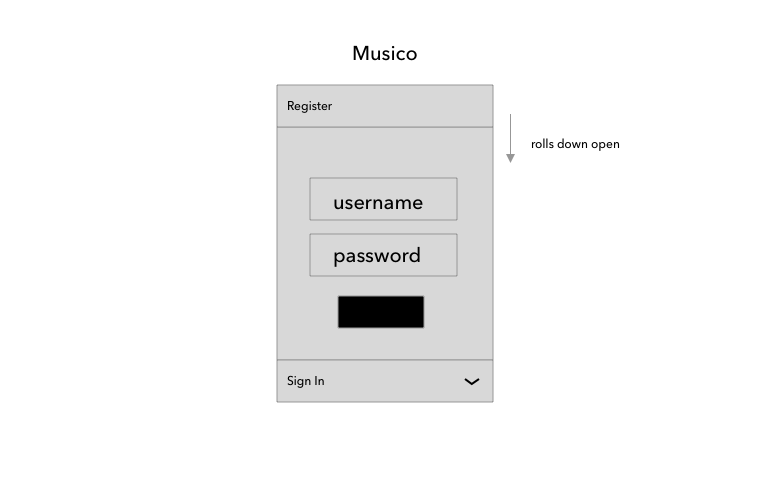
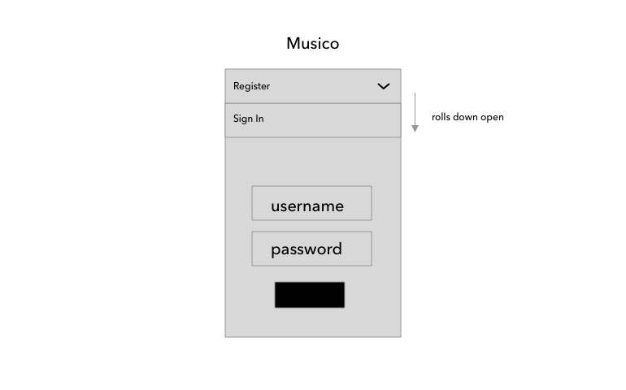
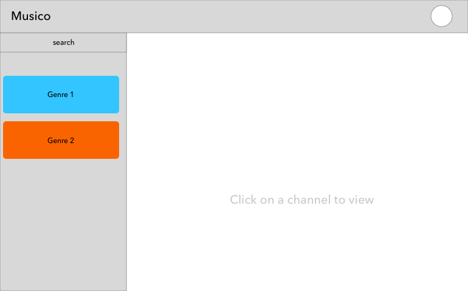
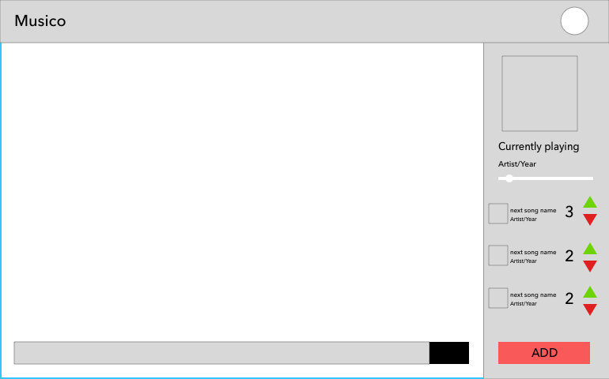
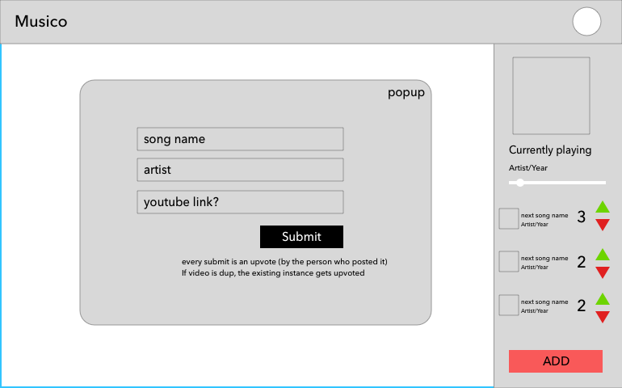
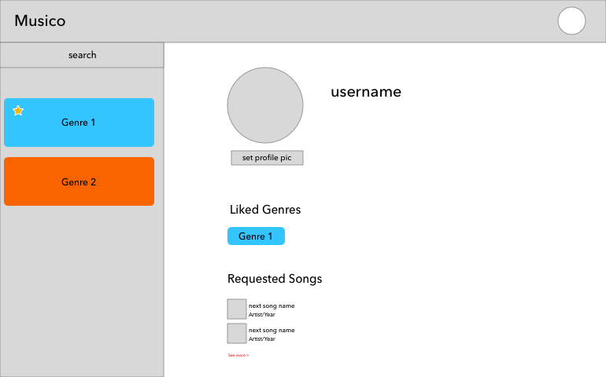

# Musico

Musico (Music-Collaborate) provides a platform for people with similar tastes in music to meet and interact with one another by integrating genre-based playlists with online chat rooms! Users can join virtual rooms playing a certain genre of music, add/upvote/downvote songs on the upcoming songs queue (more votes means the song plays sooner) and chat with other users in the room.

----

### Project Requirements

#### Detailed Description

Musico (Music-Collaborate) provides a platform for people with similar tastes in music to meet and interact with one another by integrating genre-based playlists with online chat rooms. Users can join virtual rooms, in which each room plays a certain genre of music, and request a song to be played by adding it to a queue of pre-existing requests. If a queue has no requests, music will automatically play from a default playlist selected for the corresponding genre. Each room will have its own chat, where users can meet and talk with one another. In addition, users will have their own profile showing their favourite genres and songs they have previously requested. If time permits, we hope to integrate a voting system to the request queues, allowing users to upvote songs they like to increase their ranking and hence, get those songs to play sooner.

### Task Requirements

#### Minimal Requirements:
* Rooms that automatically play a specific genre of music when users join 
    * Either from the queue of song requests or from a default playlist if the queue is empty
* A group chat for each room
* A registration and login system for users

#### Standard Requirements:
* Each user has a profile with the following information:
    * Username 
    * Profile picture
    * Their favourite music genres
    * Songs they have previously requested
* The song queue will be linked to youtube and be able to filter duplicate requests
* Users will be able to view other users’ profiles to learn about their favourite genres/songs and find common ground

#### Stretch Goals:
* Integrate user voting system on song request queues
* Add additional sources of music (Soundcloud or Spotify)
* Develop a system that can check if a song is of a particular genre

----

#### Who is it for?
Everyone! In a more narrow sense: it is for people who want to discover new music and meet people who are interested in the same genres as they are.

#### What will it do? (What "human activity" will it support?)
Musicology provides a platform for people with similar tastes in music to meet and interact with one another by integrating genre-based playlists with online chat rooms.

#### What type of data will it store?
* User profiles
* Song requests
* Chat messages

#### What will users be able to do with this data?
* User profiles will be displayed to all users to learn about each other
* Song requests go on a queue of upcoming songs (with voting, users will be able to influence which songs play sooner)
* Chat messages for users to communicate with each other

#### What is some additional functionality you can add/remove based on time constraints?
Song voting system and integrating additional music sources

### Division of Work

#### Pick 2 of your minimal requirements and break each of them down into ~2-5 smaller tasks!

**Requirement 1: Rooms that automatically play a specific genre of music when users join**
* A frontend interface based on the prototypes below:
    * A genre selection sidebar component 
    * A music player component
    * A song component for each song in the queue
* A backend queue for the music
* Default queues for each genre

**Requirement 2: A group chat for each room**
* A frontend chat component, which includes a list of messages
* Backend hooks for these components
* Some real-time chat integration using socket.io (or alternatives) and MongoDB
* User profiles for the chat, storing backend user profiles (depends on requirement 3)

**Requirement 3: A registration and login system for users**
* A component for login
* A similar component for registering users
* Backend design to store user profiles

### Prototypes
https://www.sketch.com/s/27d4371a-0086-456b-9cd1-ee272c0eec58

#### Register:

#### Sign In:

#### Landing:

#### Channel:

#### Add Song:

#### Profile:

